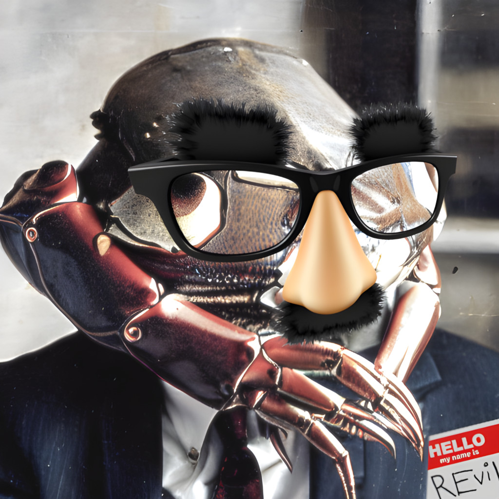

> "Heck, what's a little extortion among friends?" ~[Bill Watterson](https://en.wikipedia.org/wiki/Bill_Watterson)

# Waledac Spam Attack

To kick off the 2010s, researchers discovered the [Waledac botnet](https://en.wikipedia.org/wiki/Waledac_botnet), which had infected 70-90 thousand systems, sending over 1.5 billion spam emails per day before it was shut down.

This sounds like a lot—and it is—but this only accounted for 1% of the total global spam volume at the time. Think about that. In 2010, there were 150 billion spam emails being sent every day. There were only 7 billion people on the planet at the time, and only [2 billion people online](https://www.itu.int/net/itunews/issues/2010/10/04.aspx), which means each user (on average) got about 27 thousand spam emails per year.

That's about 104 spam emails each day, Monday through Friday, 52 weeks a year. Plus holidays.

And each day, one of those emails came from Waledac.

That's _so much spam._

Does anyone actually like spam emails? I don't. I've never heard someone say, "I'm so glad I got that spam email. It really brightened my day." It's not just annoying, it's wasteful; think of all the electricity and hardware and bandwidth being used for all that spam. It's almost as wasteful as [cryptocurrency](https://news.climate.columbia.edu/2021/09/20/bitcoins-impacts-on-climate-and-the-environment/)—and nowhere near as interesting.

I'm not sure why anyone would admit to being a spammer, let alone [rap about it](https://genius.com/Ytcracker-spammer-court-lyrics), but [YTCracker](https://en.wikipedia.org/wiki/YTCracker) gets about 8.5 thousand listeners per month on [Spotify](https://open.spotify.com/artist/1x82Mu3wakMkldMW5kEiP4?si=KedqXObRS1yS5kqnTCg1eA). I guess there's a market for it.

I digress.

To take down Waledac, Microsoft worked with the U.S. government to [take down 273 internet domains used by the botnet](https://www.helpnetsecurity.com/2010/02/26/microsoft-cripples-the-waledac-botnet/). "At Microsoft," a spokesperson said, "we don't accept the idea that botnets are a fact of life." Unfortunately, the facts of life don't require Microsoft's acceptance; Waledac was not the first botnet, nor was it the only active botnet at the time. In fact, the world has been plagued by botnets non-stop [since the dawn of the 21st century](https://en.wikipedia.org/wiki/Botnet#Historical_list_of_botnets). The [Bagle](https://en.wikipedia.org/wiki/Bagle_(computer_worm)) botnet from 2004 was [still active in 2010](https://web.archive.org/web/20160808014046/http://www.scmagazineuk.com/new-botnet-threats-emerge-in-the-new-year-from-lethic-and-bagle/article/160999/), and in 2022, at the time of this writing, users were still being infected by the [ZeroAccess botnet](https://en.wikipedia.org/wiki/ZeroAccess_botnet) that was originally discovered in 2011—_eleven years prior._ And they're only getting bigger.

Whether we accept it or not, botnets and spam are here to stay.

# Stuxnet

In 2010, the [Stuxnet trojan](https://en.wikipedia.org/wiki/Stuxnet) targeted Iranian nuclear facilities, becoming the first worm to attack [SCADA](https://en.wikipedia.org/wiki/SCADA) systems. Researchers believe Stuxnet development began in 2005, and was part of a joint operation between the United States and Israel called "[Operation Olympic Games](https://en.wikipedia.org/wiki/Operation_Olympic_Games)," though neither country has openly admitted involvement.

The [New Yorker](https://web.archive.org/web/20211114141544/https://www.newyorker.com/news/daily-comment/the-rewards-and-risks-of-cyber-war) called Stuxnet "the first formal offensive act of pure cyber sabotage by the United States against another country," though when president George W. Bush began the project in 2006, he believed it was the only way to prevent conventional attacks on Iranian nuclear facilities, achieving ([per The New York Times](https://web.archive.org/web/20220325214631/https://www.nytimes.com/2012/06/01/world/middleeast/obama-ordered-wave-of-cyberattacks-against-iran.html)) "what until then could be accomplished only by bombing a country or sending in agents to plant explosives."

Despite their best efforts to avoid collateral damage, the Stuxnet developers made an error, which allowed the worm to spread to computers beyond the scope of the original mission. This was how the worm became exposed to the public, after which researchers at Symantec and Kaspersky Lab examined the worm and revealed its secrets to the world.

Stuxnet included rootkit functionality, employed zero-day exploits, and was digitally signed with legitimate certificates stolen from Realtek and JMicron, enabling it to masquerade as legitimate software from trusted vendors. Most importantly, it proved that malicious software could cause real, physical damage. (More on this later.)

# Some Other Stuff

I know you're itching to get to the ransomware, but first I should cover some other stuff that happened in the 2010s.

* 2010
    * [Psyb0t worm](https://en.wikipedia.org/wiki/Psyb0t) infected routers and modems.
* 2011
    * [Duqu worm](https://en.wikipedia.org/wiki/Duqu), possibly related to Stuxnet, attempted to infect and gather information from industrial control systems.
* 2012
    * [Flame](https://en.wikipedia.org/wiki/Flame_(malware)) continued the trend of malware used for cyber espionage, targeting Middle-Eastern government and educational institutions, as well as specific individuals.
    * [Shamoon](https://en.wikipedia.org/wiki/Shamoon) was a destructive malware which targeted national oil companies, deemed "the biggest hack in history" by [CNN](https://money.cnn.com/2015/08/05/technology/aramco-hack/index.html).
* 2013
    * [Gameover ZeuS](https://en.wikipedia.org/wiki/Gameover_ZeuS) was a banking trojan and keylogger, stealing credentials to online banking accounts.
* 2014
    * [Regin](https://en.wikipedia.org/wiki/Regin_(malware)), a [dropper malware](https://en.wikipedia.org/wiki/Dropper_(malware)), was used by the NSA and GCHQ to spy on European governments, mostly in Russia and Saudi Arabia.
* 2016
    * The [MEMZ](https://en.wikipedia.org/wiki/MEMZ) trojan, designed as a prank for a [YouTube video series](https://www.youtube.com/watch?v=I-jdSgjtUPk) featuring "Viewer-Made Malware," caused infected systems to become unusable, requiring a complete reinstallation of Windows.
    * [Tiny Banker](https://en.wikipedia.org/wiki/Tiny_Banker_Trojan) was another banking trojan, designed to steal credentials for over two dozen financial websites.
    * The [Mirai Botnet](https://en.wikipedia.org/wiki/Mirai_(malware)) infected IoT devices worldwide, using infected devices to launch large-scale DDoS attacks against high-profile targets. The botnet inspired American musician [James Ferraro](https://en.wikipedia.org/wiki/James_Ferraro) to write an [extended play where the Mirai botnet is humanity's savior](https://en.wikipedia.org/wiki/Four_Pieces_for_Mirai_(Overture)).
* 2017
    * In April, the [Shadow Brokers](https://en.wikipedia.org/wiki/Shadow_Brokers) released a trove of stolen NSA exploits, including [EternalBlue](https://en.wikipedia.org/wiki/EternalBlue), which became hugely popular with malware authors, as it provided an easy (and wormable) infection vector for Windows systems.
* 2019
    * The [Titanium Backdoor](https://en.wikipedia.org/wiki/Titanium_(malware)) was discovered, written by the [PLATINUM APT](https://en.wikipedia.org/wiki/PLATINUM_(cybercrime_group)). It employed a complex infection sequence, including hiding data in PNG images with steganography.

# The Prodigal Malware Returns

Remember Dr. Popp's [AIDS trojan](/0x00 History/02 Malware Explosion/#the-infection-spreads) from back in '89? It was the world's first ransomware, yet it didn't even encrypt users' files! It just scrambled the directory structure. What a laugh! And the author expected victims to mail ransom checks to a P.O. box in Panama! As if the authorities couldn't just watch that mailbox and arrest whoever collected the money. What a silly idea, right?

Well, not exactly.

## The Problem

While Dr. Popp's malware had its flaws, the most grievous among them was its poor timing. You see, Dr. Popp was a couple decades too early. He wasn't alone, either; in the years following, there were a handful of other ransomware attacks, but few were very successful. Setting aside careless design flaws, such as reusing the same hard-coded encryption password across every single infected host (I'm looking at you, [Archiveus](https://en.wikipedia.org/wiki/Archiveus)), all ransomware had one common problem: currency exchange. For example, [PGPCoder](https://en.wikipedia.org/wiki/PGPCoder) (released in 2006) depended on [e-gold](https://en.wikipedia.org/wiki/E-gold) and [Liberty Reserve](https://en.wikipedia.org/wiki/Liberty_Reserve), and Archiveus required victims to purchase specific items from designated third-party websites. Each had their problems:

* E-gold was known to [report criminal activity to the authorities](http://www.smartdevicecentral.com/article/Egold+Tracks+Cisco+Code+Thief/138637_1.aspx), which made it a poor choice for criminals. Yet by 2007, the service had a reputation for catering to international terrorists and child pornographers, and were [shut down by the feds](https://www.nydailynews.com/news/crime/feds-bust-24-karat-web-worry-article-1.219589).
* Liberty Reserve began in 2006, the same year its founder was charged with violating New York State banking laws with his previous digital currency venture, [Gold Age](https://en.wikipedia.org/wiki/Gold_Age). After fleeing the United States to settle in Costa Rica, he founded Liberty Reserve, which operated without a license and was shut down by government officials in 2013.
* Third-party marketplaces like Amazon and Ebay are regularly abused by criminals for credit fraud and money laundering schemes, but they have strong anti-fraud departments that work with law enforcement agencies. This type of fraud is complicated by the fact that merchant accounts are tied to specific individuals, businesses and/or financial institutions, making criminal anonymity challenging.

Without a secure, anonymous means of currency exchange, ransomware was unsustainable.

## The Solution

In 2008, an unknown author, going by the pseudonym [Satoshi Nakamoto](https://en.wikipedia.org/wiki/Satoshi_Nakamoto), published a paper titled _Bitcoin: A Peer-to-Peer Electronic Cash System_. In it, he described a new digital currency that would be free from the control of governments and banks. He also described a peer-to-peer network that would allow users to send and receive payments without the need for a trusted third party. The paper was published on a cryptography mailing list, and was met with skepticism. But the idea caught on, and in 2009, the first Bitcoin transaction was made. At the time, few realized the implications of this new technology. In early 2013, a single Bitcoin was worth about $13. By year's end, the value had increased nearly 100 times, peaking at $1,100. What caused this sudden spike in value?

One word: Crime.

* The Silk Road, launched in 2011, became the largest online marketplace for illegal products and services worldwide. It was also the first major marketplace to accept Bitcoin as payment.
* In October 2013, as the site was reaching critical mass, the FBI shut it down and arrested its founder, Ross Ulbricht, seizing 144,000 Bitcoins, worth about $28 million at the time. As the Silk Road bust made headlines, numerous copycat marketplaces popped up, and Bitcoin's popularity exploded.
* At the start of November, the value of one Bitcoin was around $200. On November 18, [the U.S. Senate Committee declared Bitcoin a legitimate currency](https://www.bbc.com/news/technology-24986264), and the value [jumped to over $1,000](https://www.in2013dollars.com/bitcoin-price-in-2013) by the end of the month.

The world finally had a decentralized, anonymous digital currency that was widely accepted as legitimate and free from government control. It was the perfect solution for ransomware.

## When Opportunity Strikes...

Unlike Dr. Popp, the authors of [CryptoLocker](https://en.wikipedia.org/wiki/CryptoLocker)—the world's first truly successful ransomware—had impeccable timing. They began their attack in September 2013, infecting systems, encrypting files, and demanding payment for decryption. Unlike their predecessors, CryptoLocker accepted payments in Bitcoin, capitalizing on the currency's newfound popularity. While the value of the ransoms remained somewhat steady (around USD$400), the dramatic rise in Bitcoin's value magnified CryptoLocker's profits. In October, the $400 ransom payment came out to about 2 Bitcoins. By year-end, those two Bitcoins were worth about $2,000.

By the time CryptoLocker was shut down in 2014, it was estimated to have collected nearly 42 thousand Bitcoins, worth about $27 million at the time. (In 2022, that same amount of Bitcoin would be worth nearly $1 billion.) The extortion cost victims about USD$3 million, but Bitcoin's rise magnified that profit by a factor of 9.

As of the time of this writing, only one person has been charged with CryptoLocker's creation, and he still hasn't been arrested. The FBI has [offered a $3 million reward](https://www.fbi.gov/wanted/cyber/evgeniy-mikhailovich-bogachev) for information leading to his arrest.

# I Want Off This Ride

CryptoLocker was just the beginning. Following its success, countless new ransomware variants have sprung up. In 2016, Symantec declared ransomware ["the most dangerous cyber threat"](https://www.firstpost.com/tech/news-analysis/symantec-classifies-ransomware-as-the-most-dangerous-cyber-threat-3689089.html) for both organizations and individuals. Where CryptoLocker demanded ransoms of only $400, the median ransom payment in the second quarter of 2022 was USD$36,000—nearly 90 times greater.

But the cost of ransomware isn't merely financial. In 2017, the "WannaCry" ransomware forced British doctors to cancel surgeries and turn patients away. A month later, "NotPetya"—which claimed to be ransomware, but was actually a wiper—caused hospitals in Virginia and Pennsylvania to turn away patients whose records they could not access.

In 2019, 794 healthcare providers in the U.S. alone were infected with ransomware. According to [reports](https://www.nytimes.com/2020/09/18/world/europe/cyber-attack-germany-ransomeware-death.html), "emergency patients were turned away from hospitals, medical records were inaccessible and in some cases permanently lost, surgical procedures were canceled, tests [were] postponed and 911 services [were] interrupted." In Germany, after being hit by a ransomware attack, a hospital re-routed an emergency patient to another hospital 20 miles away. The patient died on the way. Authorities later determined that [the ransomware wasn't to blame](https://www.technologyreview.com/2020/11/12/1012015/ransomware-did-not-kill-a-german-hospital-patient/).

However, earlier that year, a similar ransomware attack hit a hospital in Alabama. Vital systems were taken offline, including important medical devices. A week later, a woman went to the hospital to deliver her baby, and the hospital admitted her, despite having not yet recovered from the attack. With their systems offline, medical teams could not monitor vital signs effectively. As a result, they missed a preventable complication that [led to the death of the baby](https://futurism.com/neoscope/hackers-hospital-allegedly-killed-newborn-baby).

Now, granted, the hospital should have _at least_ informed the patient of their compromised systems before admitting her, so she could have chosen to go elsewhere. But the fact remains that, had it not been for the ransomware attack, the baby would likely have survived.

Following the news, in 2020, a slew of ransomware groups claimed that they would [no longer attack hospitals](https://www.virsec.com/blog/maze-and-other-ransomware-groups-say-they-wont-attack-hospitals-during-covid19-outbreak-but-how-trustworthy-is-their-word). This was welcome news, especially in light of the emerging Covid pandemic, which was already overwhelming hospitals worldwide. Yet by year-end, [34% of healthcare organizations were hit by ransomware, rising to 66% in 2021](https://www.thomsonreuters.com/en-us/posts/investigation-fraud-and-risk/ransomware-attacks-against-healthcare/). Considering that among all organizations hit by ransomware, [those in the healthcare industry are the most likely to pay the ransom](https://news.sophos.com/en-us/2022/06/01/the-state-of-ransomware-in-healthcare-2022/), it's likely that this number will continue to rise.

## Ransomware in the 2010s

Here's a quick rundown of the [notable ransomware attacks](https://en.wikipedia.org/wiki/Ransomware#History) that happened during the 2010s:

* 2012
    * Reveton spread throughout systems in Europe, the U.S. and Canada, typically locking down systems with messages claiming to be from law enforcement agencies tasked with fighting piracy and child pornography, demanding payment for the release of the system.
* 2013
    * CryptoLocker was the first ransomware to accept Bitcoin payments, contributing heavily to its success.
* 2014
    * CryptoLocker.F and [TorrentLocker](https://en.wikipedia.org/wiki/TorrentLocker) were released, initially targeting Australian users, though they quickly spread worldwide.
    * CryptoWall not only encrypted files, but also deleted backups, making it impossible to recover without paying the ransom. In addition, it installed spyware which stole passwords and Bitcoin wallets, causing estimated losses around USD$18 million by mid-2015.
* 2015
    * Mobile ransomware Fusob was released, targeting Android devices. It posed as a pornographic video player, then poses as an accusatory authority, threatening fictitions charges if the ransom isn't paid.
* 2016
    * [Petya](https://en.wikipedia.org/wiki/Petya_(malware)) was released, infecting the [master boot record](https://en.wikipedia.org/wiki/Master_boot_record) of affected systems. It did not spread very far, but became the foundation for future attacks.
    * [SamSam](https://threatpost.com/meet-the-cryptoworm-the-future-of-ransomware/117330/) was the first wormable ransomware (or "ransomworm"), targeting JBoss servers and brute-forcing weak RDP passwords.
    * [ZCryptor](https://usa.kaspersky.com/blog/zcryptor-ransomware/7240/) was yet another ransomworm, encrypting users' files before infecting external storage and flash drives.
    * [Stampado](https://www.trendmicro.com/vinfo/de/security/news/cybercrime-and-digital-threats/new-stampado-ransomware-sold-cheap-on-the-dark-web) was a ransomware-as-a-service (RaaS) that was sold on the dark web for as little as USD$39 for a lifetime license. While not the first RaaS, it was definitely the cheapest.
* 2017
    * With the help of the EternalBlue exploit (mentioned previously), the [WannaCry](https://en.wikipedia.org/wiki/WannaCry_ransomware_attack) ransomware spread worldwide, infecting over 230,000 systems in 150 countries. While it wasn't the first ransomware to use a worm-like propagation method, it was the first to spread on such a massive scale.
    * [NotPetya](https://en.wikipedia.org/wiki/NotPetya) was released, infecting systems in Ukraine, Russia, and other Eastern European countries. Despite being derived from Petya, it was not actually ransomware, but a wiper, designed to destroy data. Like WannaCry, it spread using EternalBlue.
    * BadRabbit, following on the heels of its predecessors, affected systems in a similar manner to Petya and WannaCry, encrypting file tables. It did not use EternalBlue, instead attempting to spread via fake Adobe Flash updates, and was halted within a few days of its discovery.
    * [Syskey](https://en.wikipedia.org/wiki/Syskey) was [removed from Windows 10 and Windows Server 2017](https://docs.microsoft.com/en-US/troubleshoot/windows-server/identity/syskey-exe-utility-is-no-longer-supported) after being used in ransomware attacks. The utility, added to Windows NT in 2001, was designed by Microsoft to protect systems and sensitive data by encrypting the SAM database. Attackers posed as remote tech support, then locked victims out of their systems, demanding ransoms for passwords.
        * This proved that even legitimate software can sometimes be malware.
        * It took about six years after [attacks were reported](https://www.adobe.com/products/flashplayer/end-of-life.html) for Microsoft to officially drop `Syskey`.
        * In comparison, Adobe didn't officially terminate Flash until the first day of 2021, [despite](https://docs.microsoft.com/en-us/security-updates/securitybulletins/2006/ms06-069) [nearly](https://nvd.nist.gov/vuln/detail/CVE-2007-3456) [two](https://isc.sans.edu/diary/A+little+vunerable+%27flash+from+the+past%27+ala+MS-XP-SP3/4513) [decades](https://isc.sans.edu/diary/YA0D+%28Yet+Another+0-Day%29+in+Adobe+Flash+player/6847) [of](https://nvd.nist.gov/vuln/detail/CVE-2010-1297) [constant](https://www.computerworld.com/article/2507619/rsa-hackers-exploited-flash-zero-day-bug.html) [abuse](https://nvd.nist.gov/vuln/detail/CVE-2012-0779) [and](https://nvd.nist.gov/vuln/detail/CVE-2013-0633) [vulnerabilities](https://nvd.nist.gov/vuln/detail/CVE-2014-0515) [that](https://www.recordedfuture.com/top-vulnerabilities-2015) [just](https://www.computerworld.com/article/3073560/a-recently-patched-flash-player-exploit-is-being-used-in-widespread-attacks.html) [refused](https://www.proofpoint.com/us/threat-insight/post/apt28-racing-exploit-cve-2017-11292-flash-vulnerability-patches-are-deployed) [to](https://blog.morphisec.com/flash-exploit-cve-2018-4878-spotted-in-the-wild-massive-malspam-campaign) [go](https://www.malwarebytes.com/blog/news/2019/05/exploit-kits-spring-2019-review) [away](https://nvd.nist.gov/vuln/detail/CVE-2020-9746).
* 2018
    * [GandCrab](https://www.knowbe4.com/gandcrab-ransomware) arrived, then was raided after two months. The group persisted, retiring in July 2019 ([though their ransomware continued to propagate until at least November](https://malwiki.org/index.php?title=GandCrab)).
* 2019
    * [REvil](https://en.wikipedia.org/wiki/REvil) (a.k.a. [Sodinokibi](https://malwiki.org/index.php?title=Sodinokibi)) formed, quickly becoming one of the major players in the ransomware-as-a-service market. Turns out, they were [GandCrab all along](https://www.bbc.com/news/technology-59215167).

_You're not fooling anyone, GandCrab._

# Looking Ahead

In the early days, malware was fairly simple, and could be arranged into tidy taxonomies. (This one is a trojan; that one is a worm.) Today, however, malware has become more complex, and its shapes have shifted. What were previously considered separate categories of malware are now more like characteristics, flavors that can be mixed and matched in different combinations to achieve different results. A single attack may involve numerous smaller stages, each with its own purpose and payload. A single piece of malware may be able to perform multiple functions, and may alter its code to adapt to its environment.

For example, the news may report a ransomware attack, but the ransomware is only one part of the attack chain; an initial stager may be attached to spam emails sent by a botnet of hosts infected with remote-access trojans. The stager may act as a dropper, downloading a modular "implant" that can be configured to perform a variety of tasks, including installing additional malware, stealing data, expanding the botnet, or even launching a distributed denial-of-service (DDoS) attack. The implant may then download the actual ransomware payload, which could also double as a wiper if necessary. Weeks later, someone might drop a 0-day, and the authors may create a new implant module, enabling it to spread as a worm. And so on.

Malware is a constantly-evolving, ever-changing beast. Survival depends on our knowledge of the past, awareness of the present, and anticipation of the future. We must study, stay vigilant, be prepared.

[And never, ever pay the ransom.](https://www.cybereason.com/blog/three-reasons-why-you-should-never-pay-ransomware-attackers)