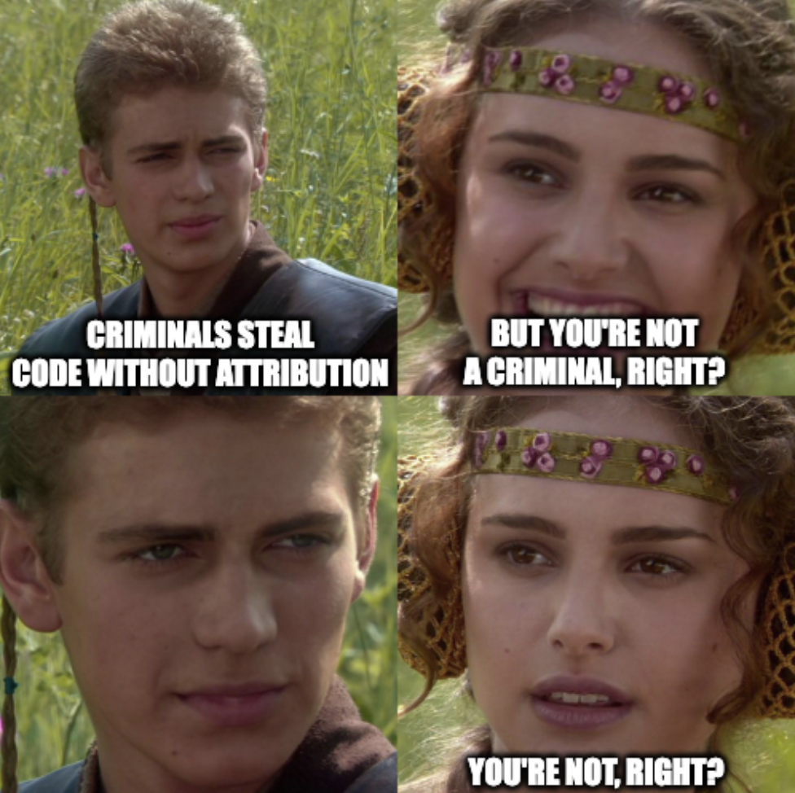

> "Good writers borrow, great writers steal." ~T.S. Eliot

# Steal Everything

Want to create effective malware quickly? Steal code from other malware! This is a common practice among malware authors, for many good reasons:

* You can focus on the interesting parts of your codebase, rather than implementing everything from scratch.
* You can learn a great deal from reading other people's code, which will make you a better malware author.
* Identification and attribution become more difficult when a sample includes code from multiple sources.
* Your malware can gain new abilities by splicing in other malware's code, like a Frankensteinian abomination.

I'll add one caveat: If you're going to publish or sell your malware or its source code, please don't steal from commercial, legitimate "malware" products like Cobalt Strike. And if you use code from open-source projects, please give credit where credit is due. Criminal malware authors regularly steal without attribution, but that doesn't make it right; if you steal code from a criminal malware sample, then discover it was originally stolen from a legitimate project, be sure to give credit to the original author and, if necessary, remove or rewrite the offending code.

# Know Your Kill Chain

In the early days, malware was relatively simple, involving just one or two stages in a single executable. Today, malware is more complex, often involving multiple modular stages, each with its own unique purpose. The stages can be chained together, each performing a specific task in support of the attacker's objectives. This design has arisen to support the attacker's "kill chain," a series of actions aimed at achieving specific goals.

## Martin and Mitre

The "kill chain" was originally a [military concept](https://en.wikipedia.org/wiki/Kill_chain) describing the structure of an attack. The "cyber kill chain," a derivative concept developed by Lockheed Martin, describes the steps required to achieve a cyber objective, such as stealing data, installing a backdoor, or launching a denial-of-service attack. Multiple alternative models have been devised, including the [MITRE ATT&CK framework](https://attack.mitre.org/), a community-driven project highly regarded throughout the security industry. The ATT&CK framework includes the following stages:

1. Reconnaissance
2. Resource Development
3. Initial Access
4. Execution
5. Persistence
6. Privilege Escalation
7. Defense Evasion
8. Credential Access
9. Discovery
10. Lateral Movement
11. Collection
12. Command and Control
13. Exfiltration
14. Impact

Each stage is broken down further into tactics and techniques. For example, the "Initial Access" stage includes the following tactics, each with their related techniques:

* Drive-By Compromise
* Exploit Public-Facing Application
* External Remote Services
* Hardware Additions
* Phishing
* Replication Through Removable Media
* Supply Chain Compromise
* Trusted Relationship
* Valid Accounts

## Breaking it Down

It is foolish to attempt to cover every posible stage, tactic and technique in a single malware payload. Instead, most malware authors focus on specific stages and techniques, deploying multiple payloads to achieve their goals. For example, a ransomware attack may employ the following techniques:

1. Reconnaissance
    * Identify the target's organizational structure, including the names of key personnel.
    * Gather email addresses for key personnel and related individuals.
2. Resource Development
    * Create or obtain malware samples.
    * Stage malware on remote servers with deceptive domain names.
3. Initial Access
    * Send phishing emails with malicious links or attachments.
    * Links and attachments aim to launch stager code.
4. Execution
    * Stager code downloads and executes the main payload.

Once the main payload is executed, it will typically deploy a command-and-control module, which will then use additional modules to handle persistence, privilege escalation, lateral movement, etc. This is a common design pattern, employed by countless malware families. In the case of ransomware, the malware will typically deploy data exfiltration and encryption modules, designed to steal and encrypt the victim's data.

## Droppers, Stagers, Payloads and Modules

Modern malware is typically divided into a few distinct components:

* Droppers: A self-contained package designed to deliver and launch a malware stager.
* Stagers: Lightweight code designed to install a malware payload onto a system.
* Payloads: Typically a C2 implant, providing remote command and control to attackers.
* Modules: Single-purpose, specialized code, designed for use with a modular C2 implant.

We will explore each component in more detail in the following sections.

# Don't Infect Yourself

Mistakes happen. Even the most careful malware authors can accidentally infect their own systems. If you're going to write malware, you need to take precautions against self-infection. Here are some tips:

* Use virtual machines. If you're using cloud services, use disposable VMs, such as Google's [Spot VMs](https://cloud.google.com/spot-vms).
* Avoid developing, building and testing malware on your primary workstation.
* Use separate VMs for coding, building and testing, to avoid cross-contamination.
* Use a separate network for testing, and disable all external network access to the testing VM.
* Keep regular, redundant backups of your VMs and other essential data, and test your backups regularly.
* "De-claw" your malware during testing, using benign placeholders for dangerous components whenever possible.
* When testing propagation techniques, use a limited scope to prevent accidental infection.
* Disconnect shared drives and network shares when testing malware.