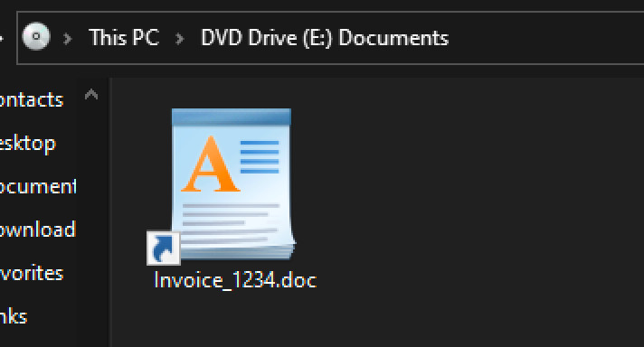
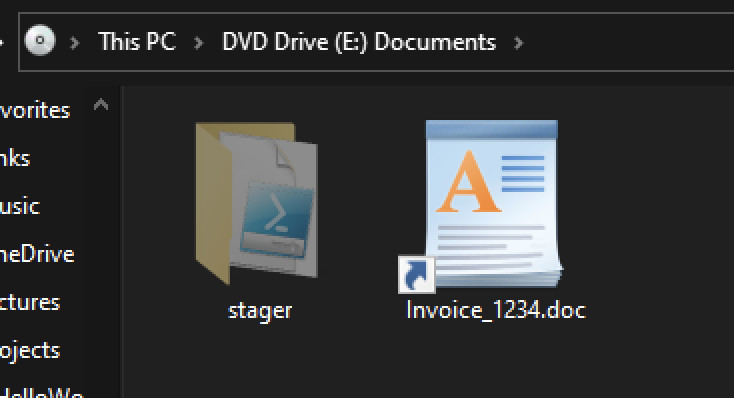

<h1>Step 2: Build the ISO</h1>

## ISO Design

Having completed the [LNK dropper](20 LNK.md#lnk-construction) and its associated stager, we can now bundle them in an ISO. When the target opens the ISO, we only want them to see the LNK file, not the directory containing the stager code. Therefore, when making the ISO, we'll need to hide the `stager` directory.

## ISO Construction

Windows provides simple tools for reading ISO files, but no built-in functionality for creating them. We'll use PowerShell, along with a custom ISO library, to put everything together.

First, download the [New-IsoFile.ps1](https://github.com/wikijm/PowerShell-AdminScripts/blob/master/Miscellaneous/New-IsoFile.ps1) script and save it into the `PoC Dropper` directory. Then create a PowerShell script called `build_iso.ps1` in the same directory, with the following contents:

```sh
. .\New-IsoFile.ps1; # Load the New-IsoFile cmdlet.

# Hide the stager folder
Set-ItemProperty -Path "iso\stager" -Name "Attributes" -Value "Hidden";
# Create the ISO
dir -force iso | New-IsoFile -Path "document_archive.iso" -Media CDR -Title "Documents" -Force | Out-Null;
# Un-hide the stager folder
Set-ItemProperty -Path "iso\stager" -Name "Attributes" -Value "Normal";
```

This script hides the `stager` directory, builds an ISO called `document_archive.iso` in the `PoC Dropper` directory, then un-hides the `stager` directory.

## Confirming the Build

Before we send the ISO to a target, we need to confirm that it works. Double-click the resulting `document_archive.iso`. When it opens, you should see the `Invoice_1234.doc.lnk` file:



If we enable the **Hidden items** option in the **View** menu, we can see the hidden `stager` directory:



Success! We're now ready to build the HTML dropper.